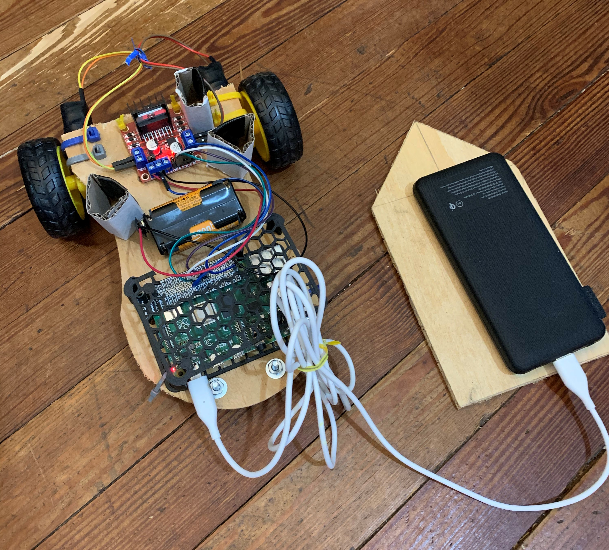

# ccr_robotics_fall_2020

Course materials for Fall 2020 robotics class at [Cornerstone Classical Roanoke](https://cornerstoneclassicalroanoke.org/).

Course Instructor: Stuart Bowman (e.g. [buffetboy2001 on GitHub](https://github.com/buffetboy2001), [faculty listing](https://cornerstoneclassicalroanoke.org/stuart-bowman))

## Course Goals

A basic instruction to the interdisciplinary world of robotics will be covered. Students are not expected to have any technical background at all, but will learn little-by-little along the way using hands-on projects.

We'll cover:

* Robotics Overview
* Introduction the Raspberry Pi computer
* Introduction to the Python programming language
* Introdution to electronics
* And...we'll build a [simple buggy!](https://projects.raspberrypi.org/en/projects/build-a-buggy)
* And...then we'll make it [drive on it's own!](https://projects.raspberrypi.org/en/projects/rpi-python-line-following).

## Syllabus

Take a look at the [course syllabus](./resources/syllabus.md).

## Itemized List

Take a look at the [component Excel sheet](./resources/component_sheet.xlsx).
