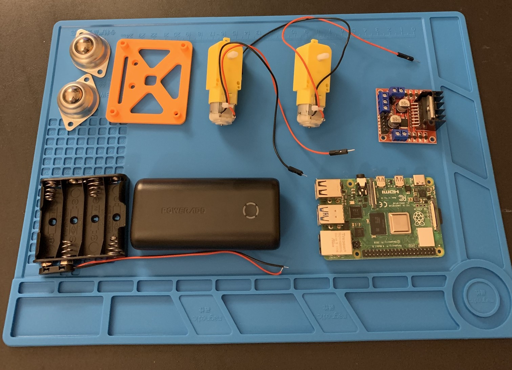

# Building "Robby": A Simple Guide

_by Mr. Bowman_

This guide has my name on it, but is lovingly based on the wonderful guide found [on raspberrypi.org](https://projects.raspberrypi.org/en/projects/build-a-buggy). In some cases, I have even copied & pasted their guide's text. :) Think of this as a modern example of pseudopigraphy.

## Vehicle Assembly Basics

* Design Decision: Figure out which end is forward. Draw a clear arrow on the board pointing forward. Make sure your whole team agrees on this decision.
* Decorate your chassis! May as well. You have markers and stickers -- pass it around & make it your own!
* Component Layout: figure out where your major components are going to fit on the chassis. Pay attention to:
    * Raspberry Pi
    * Wheel locations
        * **Design Decision**: Discuss as a team if you want to use one castor wheel or two. Either way is fine, but have the discussion. Screw them into place.
    * USB battery location
    * AA battery location
    * L298N location
    
    **NOTE**: Feel free to mark the board up using your Sharpie.

Feel free to pick a new team name. If you do, make sure you tell Mr. Bowman what your new name is. 

## Raspberry Pi Interaction

Your Pi is a computer on it's own. But, it's not connected to a monitor, keyboard, or mouse. :( So, if you want to do stuff on it....what ya gonna do? Follow these instructions to get your Kano connected to your Pi. This will allow you to wirelessly control the Pi from your Kano. 
* Turn on your Kano and log in as `Team-whatever`
* Make sure you have an internet connection
* Turn on the Mobile Hotspot connection
* Turn on your Pi
* On the Kano, you should see the Pi connect
    * Figure out the IP address of the Pi
* On the Kano:
    * Open a terminal window
    * Type: `ssh pi@<rpi_ip>`
    * Type: `./run_vncserver.sh`
    * Type: `exit`
    * Open VNC Viewer
    * Connect to the Pi
* In the Pi view, open your code editor:
    * `code-oss` is your friend when it comes to writing Python code!

FYI: This connection will last for as long as the Pi is on. If you turn it off or run out of battery power for the Pi, the connection will drop.

## Wheel Testing & Assembly

You will need these on your project mat:

* the Motor Controller Board (L298N)
* AA battery holder
* Both motors (wheels don't need to be connected). Wires must be connected to the motor.
* Raspberry Pi

### Assembly Steps

* On the L298N Motor Controller board, identify the wire ports labeled:
    * OUT1, OUT2, OUT3, OUT4, GND, 12V.
    * Make sure at least two teammates can find them.
* Using a screwdriver, loosen the screws in the terminal blocks labeled OUT1, OUT2, OUT3, and OUT4. Insert the ends of four wires into the terminal blocks.
* Connect the wires from the battery holder to the L298N Motor Controller board.
    * Black wire to GND
    * Red wire to 12V
* Tighten all screws _gently_ so that the wires stay in-place.

### Power Assembly

The Raspberry Pi computer can only provide so much electrical energy to other things connected to it. In the case of the L298N motor controller and the wheels, they need more electricity than the Pi can give. :( 

No worries! You'll also connect 4 AA batteries and use _those_ to power the wheels.

* On the L298N Motor Controller board, identify the wire ports labeled:
    * 12V, GND
    * Make sure at least two teammates can find them.
* Get the AA battery case
* Loosen the screws on those and insert:
    * the red wire on the AA battery case to 12V
    * the black wire on the AA battery case to GND
* Tighten all screws _gently_ so that the wires stay in-place.

## Connect the Raspberry Pi to your Components

Time to get your components connected to the robot brain -- the Raspberry Pi! 

----

## Vehicle Assembly
