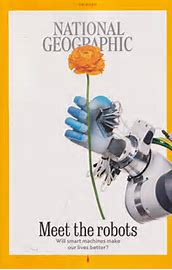
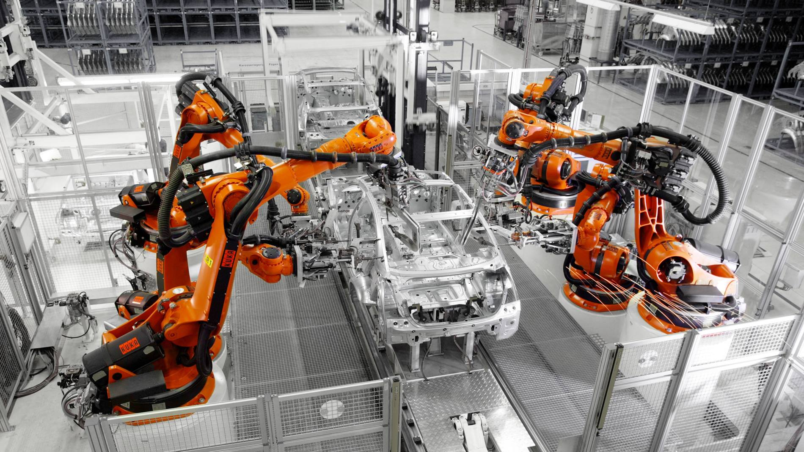
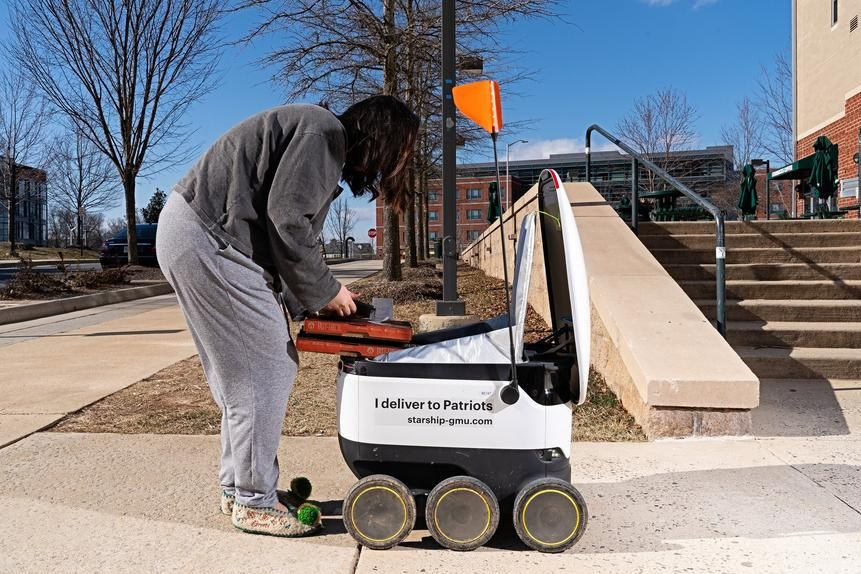
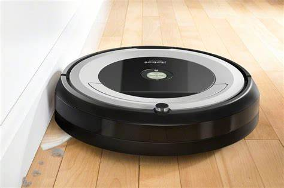
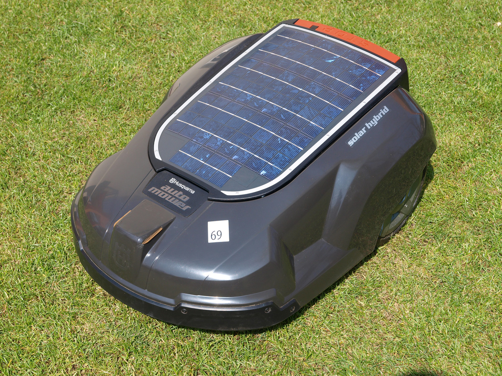
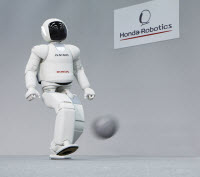
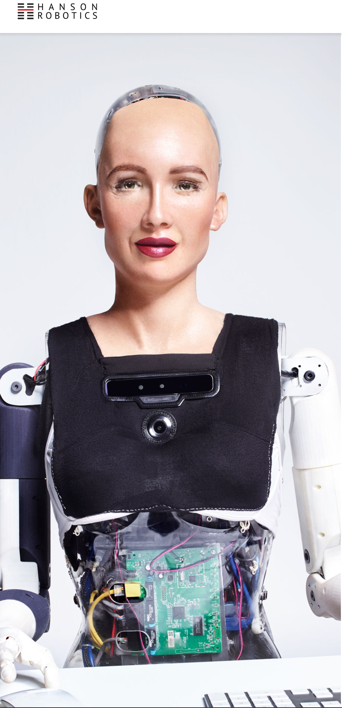

# Robot Examples

We're comfortable with the idea of robots. Lots of images come to mind of examples we've seen, stories we've heard. Science is advancing!

The robots are here and we need to meet them...or be prepared...or know what to do with them...or know what to think about them...or, what?

---
But -- What _is_ a robot? That's a tough question. Let's look at some examples.

## Industrial & Manufacturing

Robots can build cars

Robots can deliver convenience products

## Home Stuff

Yay! Do my work for me!

^^^Who doesn't want one of those?

And robotic lawn mowers. Sweet!

## Humaniod

Robots can kick balls

And look super creepy...

---

But still: what _is_ a robot?

Robotics is a discipline: engineering + computer science.

The goal of robotics: design machines that operate autonomously to perform a complex task that humans normally do. The robot should be able to help & assist the human.
