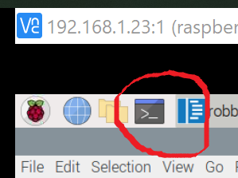

# Vehicle Build

**Module Goal**: build your full vehicle ("Robby") and get comfortable driving it forward and backward.

## Put Robby Together

You've learned how to wire the main components together. And you've got **forward motion** figured out and marked in your notes. Now it's time to finally put Robby all together!

Use your zip ties to connect everything solidly to the chassis. (Zip ties are an amazing quick-fastener; every maker's & DIYer's friend!)

Here's the kind of design you're looking for. But make sure you follow your original design for each component's place, not this picture.


## Drive Robby Forward

Once you have Robby built, go into a break-out room and take Robby for a test-drive!
* Turn on the Pi and get the Kano VNC Session connected
* Power up the L298N Motor Controller board

Make Robby go forward!

Reminder, this is how you make Robby go **forward**.
* Open the terminal on the Pi


* In the terminal, type: `python3 robby.py` and **Enter**
* Your wheels should start turning!

## Play Around

What can you do to make Robby drive further? Or a shorter distance?

Does Robby drive in a straight line? Probably not. But why? :confused:

## Drive Robby Backward

If you've successfully gotten Robby to drive forward, now it's just a quick code change to go backward. Open your python code again in `robby.py`. Change `forward()` to `backward()` in your python code. Like this:

```python
#!/bin/python3

# Our team's simple test module

from gpiozero import Robot
import time

robby = Robot(left=(7, 8), right=(9, 10))

# robby.forward()
robby.backward()
time.sleep(20)
robby.stop()
```

---

**Module Complete**
