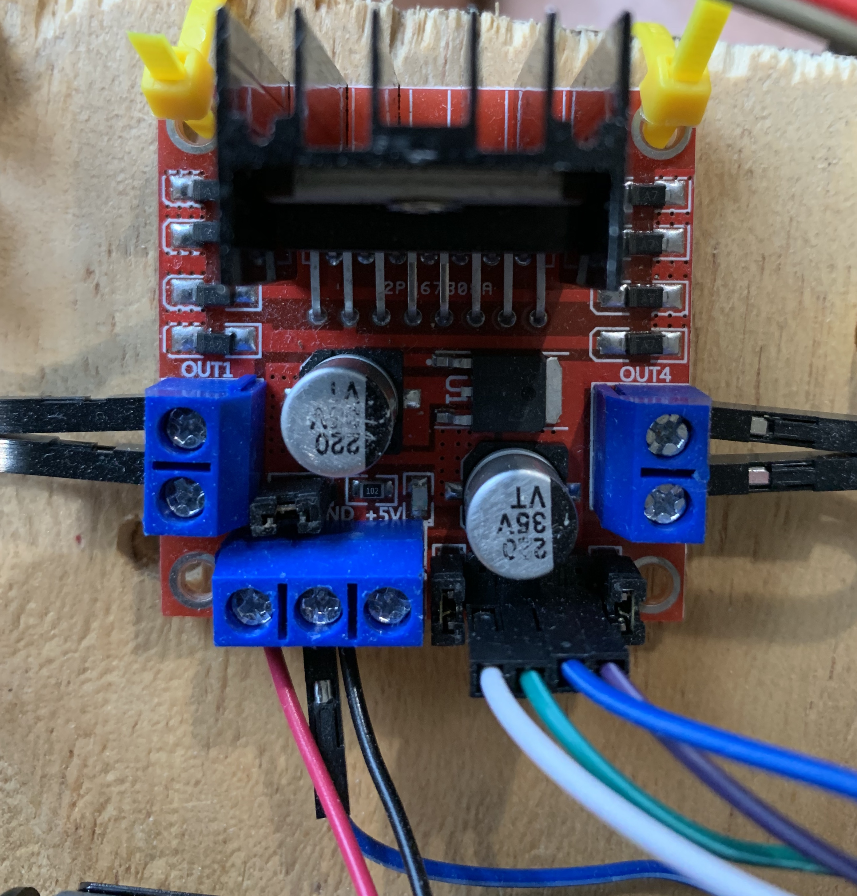

# Wheel Assembly

Before doing the full assembly, you'll need to make sure your wheels work. This module will show you how to test it all -- using the Pi.

You will need these on your project mat:

* the Motor Controller Board (L298N)
* AA battery holder
* 4 AA batteries
* Both yellow wheel motors (wheels don't need to be connected, but can be).
* Raspberry Pi
* USB battery for Pi

## Drive Wheel Assembly Steps

* On the L298N Motor Controller board, identify the wire ports labeled:
  * OUT1, OUT2, OUT3, OUT4
  * **NOTE**: Make sure at least two teammates can find them.
* Using a screwdriver, loosen the screws in the terminal blocks labeled OUT1, OUT2, OUT3, and OUT4. 
* With one yellow wheel motor, insert the ends of the two wires into **OUT1** & **OUT2**
  * Do this again with the other motor and **OUT3** & **OUT4**
* Connect the wires from the battery holder to the L298N Motor Controller board.
  * **Black** wire to **GND**
  * **Red** wire to **12V**
* Tighten all screws _gently_ so that the wires stay in-place.

## Power Assembly

The Raspberry Pi computer can only provide so much electrical energy to other things connected to it. In the case of the L298N motor controller and the wheels, they need more electricity than the Pi can give. :( 

No worries! You'll fix this problem by also connecting 4 AA batteries to the L298N and use _those_ to power the wheels.

* On the L298N Motor Controller board, identify the wire ports labeled:
  * **12V**, **GND**
  * **NOTE**: Make sure at least two teammates can find them.
* Using the AA battery case, loosen the screws on those and insert:
  * the **Red** wire on the AA battery case to 12V
  * the **Black** wire on the AA battery case to GND
* Tighten all screws _gently_ so that the wires stay in-place.

## Connect the Raspberry Pi to your Components

Time to get your components connected to the robot brain -- the Raspberry Pi!

**NOTE**: Make sure it's turned **OFF** when connecting wires!

Get 4 female-to-female wires.

* On your L298N Motor Controller board, identify **IN1**, **IN2**, **IN3**, **IN4**.
* Connect the 4 wires to each of the **IN**s.

Get your Raspberry Pi and observe the following picture:

Now, make the following connections.

| L298N Connection Pin | Raspberry Pi Connection Pin |
| --- | ---- |
| **IN1** | GPIO 7 |
| **IN2** | GPIO 8|
| **IN3** | GPIO 9|
| **IN4** | GPIO 10|
| **GND** | GPIO GND (there are several; chose any you like) |

Now your Raspberry Pi and your L298N Motor Controller board are connected!

---

The L298N Motor Controller Board should start to look like this:

If you're not sure, as Mr. Bowman for a double-check!

---